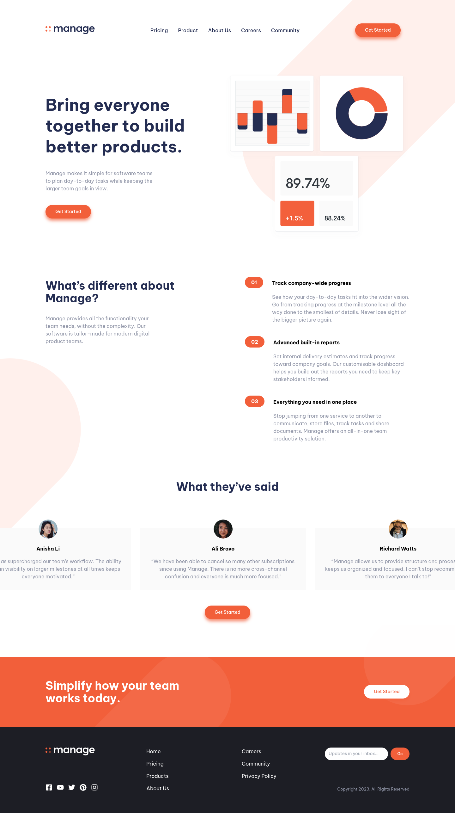

# Frontend Mentor - Manage landing page solution

This is a solution to the [Manage landing page challenge on Frontend Mentor](https://www.frontendmentor.io/challenges/manage-landing-page-SLXqC6P5). Frontend Mentor challenges help you improve your coding skills by building realistic projects.

## Table of contents

- [Overview](#overview)
  - [The challenge](#the-challenge)
  - [Screenshot](#screenshot)
  - [Links](#links)
- [My process](#my-process)
  - [Built with](#built-with)
  - [What I learned](#what-i-learned)
  - [Continued development](#continued-development)
  - [Useful resources](#useful-resources)
- [Author](#author)
- [Acknowledgments](#acknowledgments)

## Overview

### The challenge

Users should be able to:

- View the optimal layout for the site depending on their device's screen size
- See hover states for all interactive elements on the page
- See all testimonials in a horizontal slider
- Receive an error message when the newsletter sign up `form` is submitted if:
  - The `input` field is empty
  - The email address is not formatted correctly

### Screenshot



### Links

- Solution URL: [GitHub](https://github.com/drfcozapata/manage-landing-page)
- Live Site URL: [Netlify](https://manage-landing-dev.netlify.app/)

## My process

### Built with

- [Vue.js](https://vuejs.org)
- TailwindCSS
- SASS/SCSS
- vue3-carousel
- Fontawesome Icons

### What I learned

I learned how to use Teleport to create a modal in Vue.js without using external libraries or composables. I learned how to use and style Vue3-Carousel to create the testimonial slider. I reinforced my knowledge of TailwindCSS, CSS and SASS/SCSS for layout. And I learned how to get control of the time of completion of a site to help me estimate future similar projects. This was done in a total of 32 hours, distributed in 4 days, working without pressure.

With this code the modal component is loaded, without further complications. The rest is pure CSS.

```vue
<script setup>
	import { ref } from 'vue';
	import MenuModal from './MenuModal.vue';

	const showModal = ref(false);
</script>

<template>
	<nav>
		...

		<Teleport to="body">
			<MenuModal :show="showModal" @close="showModal = false" />
		</Teleport>
	</nav>
</template>
```

### Continued development

In future projects I plan to deepen the use of Teleport and implement Composables, so that I can use less and less third-party libraries and start creating my own library of reusable components.

### Useful resources

- [Teleport en Vue.js oficial documentation](https://vuejs.org/guide/built-ins/teleport.html) - Teleport is a built-in component that allows us to "teleport" a part of a component's template into a DOM node that exists outside the DOM hierarchy of that component.
- [Vue3-Carousel](https://ismail9k.github.io/vue3-carousel/) - Flexible, responsive, and highly customizable Vue carousel component to suit almost all your use cases.

## Author

- My Portfolio - [Francisco Zapata](https://drfcozapata.github.io)
- Frontend Mentor - [@drfcozapata](https://www.frontendmentor.io/profile/drfcozapata)
- Twitter - [@drfcozapata](https://www.twitter.com/drfcozapata)

**Note: Delete this note and add/remove/edit lines above based on what links you'd like to share.**

## Acknowledgments

To the entire Frontend Mentor team, who make these challenges possible for our professional growth.
